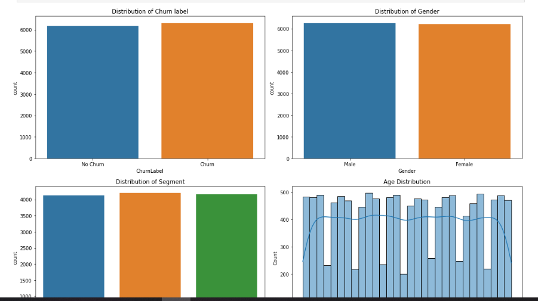
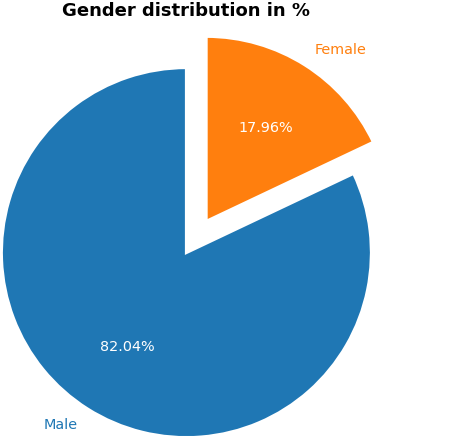

<!--Section 1: Introduce your self-->
## ABOUT ME

Hello! I'M Odey Alexander Michael 🤓, a data analyst, a data scientist and a behavioural therapist. Passionate about  using data, research and behavioral insights in solving business problems, improve operational performance, and support data-driven decision-making.. my experience span across sales, operations, finance, and customer's experience/service and health care, I help businesses solve challenges and unlock growth.

<!--Mention your top/relevant skills here - core and soft skills-->
## WHAT I DO

*I provide in-depth analysis and tailored solutions, unlock growths, optimize processes through data driven approach, modify work-place behaviours for enhance performance and optimum productivity..*

**- ✅ Core Skills.**
Problem solving and Critical thinking. 
Trends Forecasting and Predictive modelling, 
Business Acumen, data story telling and stakeholder collaboration,
Attention to detail, Report automation, Process optimization Business Intelligence and KPI's Monitoring. 

**- ✅ Technical Skills.**
Visualization tools power BI, Tableau. 
Programming Language Python for data analysis. 
EDA's Jupyter note book. 
Database querying language SQL. 
Excel features; VLOOKUP, Index match, power Query, Pivot Tables

<!--Section 2: List 3-4 key projects-->
## MY PROJECTS 

*A glimpse of some of the projects I've worked on.*
**Churn rate prediction for Redar Telecom company.**

In this project I help a telecom company figure out the likely hood of customers who susceptible  to churn from subscribing to the network.

[Read More](https://github.com/alexmike2707/CHURN-PREDICTION/blob/main/Churn%20Prediction%20for%20Reder%20Telcom.ipynb)

**tool used python; pandas, numpy & matplotlib for data manipulation and EDAs.**

**Disecting the trends and growth in the tech industry.**

In this project I analyze the trends, growth and the demands as its stand in the data analytics, data science and the tech industry in general. 

[Read More](https://github.com/alexmike2707/THE-FIELD-OF-DATA-SCIENCE-TRENDS-AND-ITS-GROWTH-/blob/main/DATA%20SCIENCE%20JOBS%20DATA%20SET.ipynb)

**tool used python; pandas, numpy & matplotlib for data manipulation and EDAs.**

**I recently conducted an analysis on dataset to uncover pattern of mental health diagnosis.**

The findings from this work help mental health workers to gain insight about patterns, sentiment psychological indicators and how mental helth begins to manifest before degenerating .

[Read More](https://github.com/alexmike2707/MENTAL-HEALTH-ANALYSIS/blob/main/MENTAL%20HEALTH%20DATA.ipynb)

**tool used python; pandas, numpy & matplotlib for data manipulation and EDAs.**

## CONTACT DETAILS

*Let’s connect and see how we can make a difference together!*
<table>
  <tbody>
    <tr>
      <td>📧</td>
      <td><a href="mailto:alexmike2707@gmail.com">alexmike2707@gmail.com</a></td>
    </tr>
    <tr>
      <td>📞</td>
      <td>(234) </td>
    </tr>
    <tr>
      <td>📍</td>
      <td>ABJ, Nigeria, open to Relocation</td>
    </tr>
    <tr>
      <td>⬇️</td>
     <a href=" Odey .A. Michael Resume.pdf/doc">Download my Resume here </a>
    </tr>
    <tr>
      <td>🌐</td>
        <td><a href="https://linkedin.com/in/odey-michael">You can connect with me on LinkedIn</a></td>
    </tr>
    <tr>
      <td>📺</td>
      <td><a href="https://github.com/alexmike2707">View my Profile on Github here</a></td>
    </tr>
  </tbody>
</table>

   

    
    

   

   

